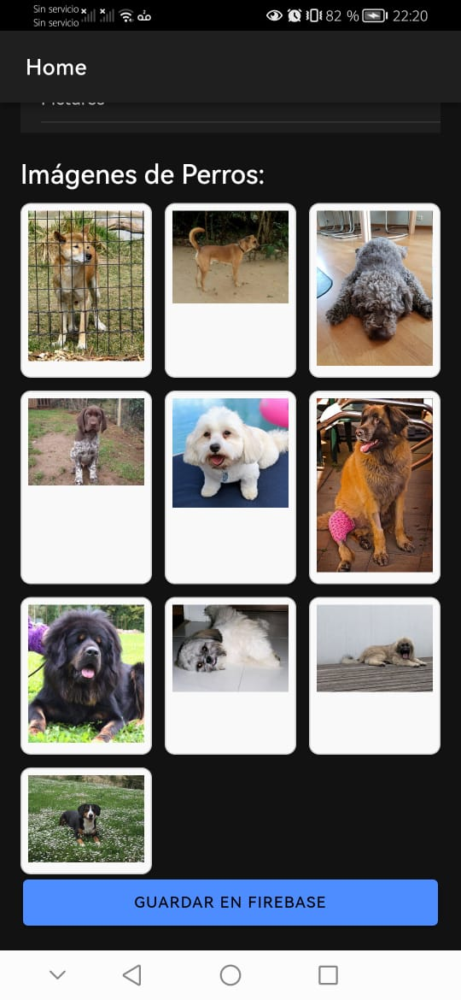

# CONSUMO DE APIDOG Y API DE LIBROS
Mediante una aplicación realizada con el framework Ionic se realizó el consumo de las APIS públicas.
La aplicación permite al usuario la visualización de diez distintos titulos de libros y de diez fotografias de perritos.
## Captura de la aplicación

## Autor
Esta implementación  fue creado por  Erick Caiza.